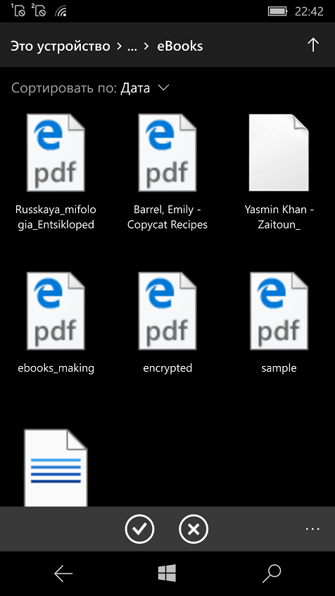
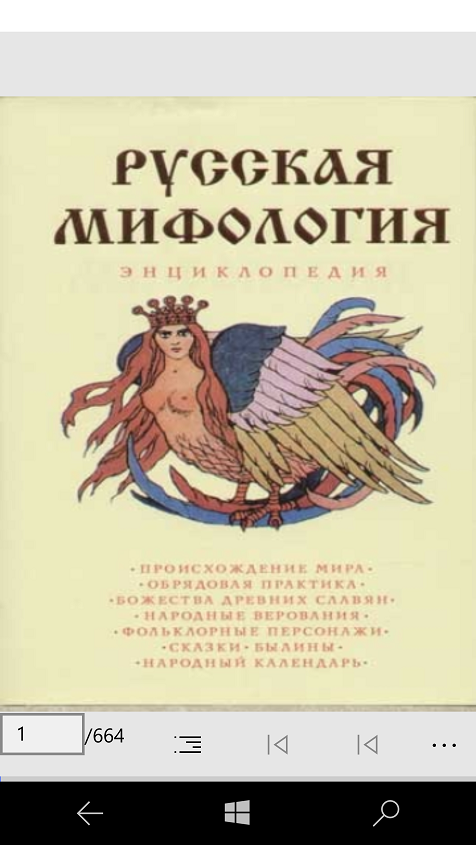
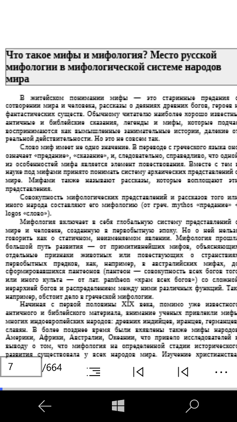

# BookReaderApp v1.1-alpha

Kurema's BookReaderApp "Fast Reverse Engeneering"

## Screenshots

  
  
 
 
  
 
 
  
 

## My 2 cents
- W10M quick & dirty XAML adaptation
- "Project Astoria" compatibility (so, min. W10M build = 10240!)

## Tech. details
- VS 2022 Preview (my "workbanch")
- App class: UWP
- Targets: ARM, x86 (*as you wish*)
- Win. SDK: 19041
- Min. Win. SDK: 10240 (hello, Astoria!)

## Credits / Reference
- https://github.com/kurema The developer of BookViewer 3, the UWP app to read books
- https://github.com/kurema/BookViewerApp Original BookViewer/BookReader 1 

## ..
As is. No support. RnD only. DIY

## .
[m][e] 2024